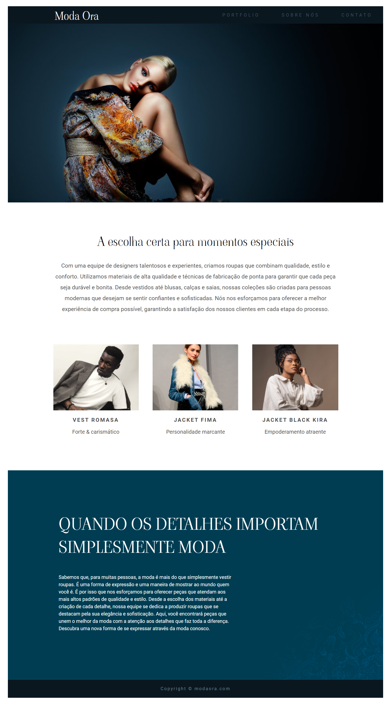

# Projeto Moda Ora

Esse projeto é minha solução ao desafio apresentado na seção 8 do curso: Curso Web Frontend Fundamentos HTML5 CSS3 e JS + 10 Projetos. Esse desafio teve como foco a implementação, sem consulta, de uma pagina web a partir de uma screenshot modelo.

Imagem do resultado obtido.

